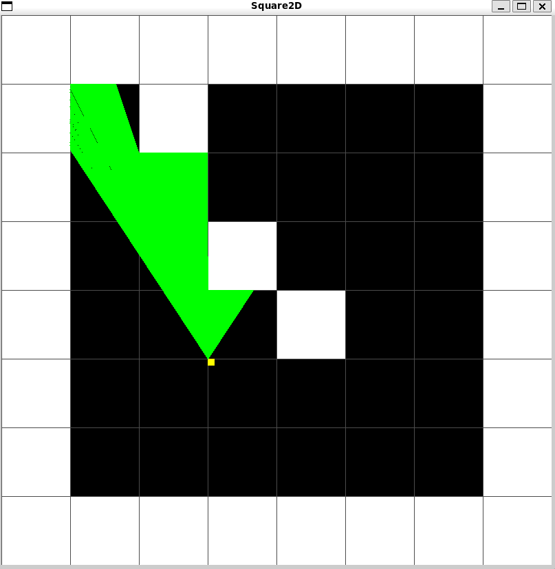
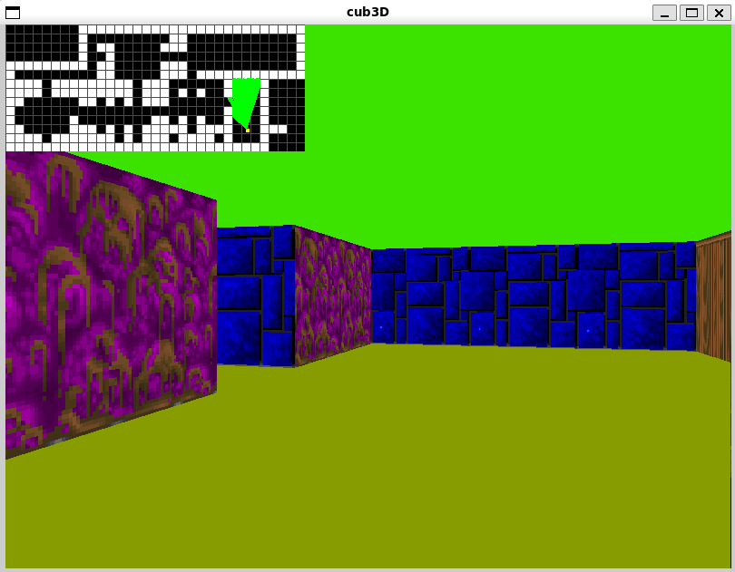

# Cub3D - A Wolfenstein 3D Style Raycaster
[sq2D README](sq2D_test/README.md)


## Project Overview

Cub3D is a 3D raycasting engine inspired by the classic game Wolfenstein 3D. This project uses the miniLibX graphics library to create a first-person perspective 3D environment from a 2D map, demonstrating fundamental computer graphics techniques used in early 3D games.

## Key Features

- **Raycasting Engine**: Creates a 3D perspective from a 2D map
- **Texture Mapping**: Different wall textures for each cardinal direction
- **Dynamic Lighting**: Floor and ceiling colors with distance shading
- **Player Movement**: WASD keys for movement, arrow keys for looking
- **Minimap**: 2D overhead view of the map
- **Collision Detection**: Prevent walking through walls
- **Map Validation**: Ensures maps are properly enclosed

## Technical Implementation

### 1. Map Parsing and Validation

The game reads map files with `.cub` extension that define:

- Wall textures (`NO`, `SO`, `WE`, `EA`)
- Floor and ceiling colors (`F`, `C`)
- The 2D map layout

**Map Validation Process:**

- **Character Validation**:
    - Only `'0'`, `'1'`, `'N'`, `'S'`, `'E'`, `'W'`, and `' '` are allowed
    - Exactly one player start position (`N`/`S`/`E`/`W`)

- **Wall Enclosure Check**:
    - Uses flood-fill algorithm to ensure all walkable areas are enclosed by walls
    - Prevents "escaping" the map boundaries

```c
int checkwall(t_game *game, char **map)
{
    int x, y;
    y = 0;
    while (y < game->map_height) {
        x = 0;
        while (x < game->max_len) {
            if (ft_strchr("0NSWE", map[y][x]) && wallcheck(game, x, y, map))
                return (1);
            x++;
        }
        y++;
    }
    return (0);
}
```

### 2. Raycasting Algorithm

The core 3D rendering uses **Digital Differential Analysis (DDA)** algorithm for efficient ray-wall intersection detection:

For each vertical screen column:

- Calculate ray direction from camera plane
- Determine which map square the ray starts in
- Calculate step direction and initial side distances

**DDA Algorithm**:

- Jump to next map square in either x or y direction
- Check for wall hits
- Calculate perpendicular wall distance (avoiding fisheye effect)

**Wall Rendering**:

- Calculate line height based on wall distance
- Determine texture coordinates
- Draw vertical stripe with proper texture

```c
void draw_pa_ray(t_game *game)
{
    t_data3d d;
    while (d.x < WIDTH) {
        d.camerax = 2 * d.x / (double)WIDTH - 1;
        d.raydirx = game->pdx + game->planex1 * d.camerax;
        d.raydiry = game->pdy + game->planey1 * d.camerax;
        // DDA algorithm
        while (game->map_arr[d.mapy][d.mapx] != '1') {
            if (d.sidedistx < d.sidedisty) {
                d.sidedistx += d.deltadistx * SPRITE_SIZE;
                d.mapx += d.stepx;
                d.side = 0;
            } else {
                d.sidedisty += d.deltadisty * SPRITE_SIZE;
                d.mapy += d.stepy;
                d.side = 1;
            }
        }
        // Calculate wall distance and draw
    }
}
```

### 3. Player Movement and Rotation

Player physics includes:

- Position updates based on orientation
- Collision detection against walls
- Smooth rotation with direction vector updates

```c
void keyhook_aswd(t_game *game, double pa)
{
    double next_x = game->pposx + PLAYER_SIZE * cos(pa);
    double next_y = game->pposy + PLAYER_SIZE * -sin(pa);
    
    if (game->map_arr[(int)(next_y/SPRITE_SIZE)][(int)(next_x/SPRITE_SIZE)] != '1') {
        game->pposx = next_x;
        game->pposy = next_y;
    }
}
```

### 4. Texture Mapping

- Each wall direction (N/S/E/W) can have unique textures
- Textures are loaded from XPM files
- Texture coordinates calculated based on wall hit position

```c
void load_texture(t_game *game)
{
    int i = 0;
    while (i < 4) {
        game->tex[i].texture_ptr = mlx_xpm_file_to_image(game->mlx, 
            game->texture[i], &game->tex[i].tex_width, &game->tex[i].tex_height);
        game->tex[i].texture_addr = mlx_get_data_addr(...);
        i++;
    }
}
```

## File Structure

```
cub3d/
├── en.subject.pdf           # Project subject PDF
├── README.md                
│
├── cub3d/                   # Main 3D project
│   ├── Makefile             # Build instructions
│   │
│   ├── include/             # Header files
│   │   ├── cub3d.h          # Main header
│   │   └── keycodes.h       # Keyboard codes
│   │
│   ├── libs/                # External libraries
│   │   ├── libft/           # Custom C utility library
│   │   └── minilibx-linux/  # Minimal graphics library
│   │
│   ├── srcs/                # Source files
│   │   ├── cub3d.c          # Main program entry
│   │   ├── draw.c           # Drawing functions
│   │   ├── drawray.c        # Raycasting logic
│   │   ├── drawray3d.c      # 3D rendering
│   │   ├── free.c           # Memory management
│   │   ├── init.c           # Initialization code
│   │   ├── keyhook.c        # Keyboard input handling
│   │   ├── linecheck.c      # Map line validation
│   │   ├── load.c           # Resource loading
│   │   ├── mapcheck.c       # Map validation
│   │   ├── mapline.c        # Map line parsing
│   │   ├── minimap.c        # 2D minimap rendering
│   │   ├── mlx.c            # MiniLibX wrapper
│   │   ├── texture.c        # Texture management
│   │   └── utils.c          # Helper functions
│   │
│   └── xpm/                 # Texture files
│
└── sq2D_test/               # 2D test project
    ├── Makefile             # Build instructions
    ├── README.md            
    ├── small                # Example data file
    ├── sq2d                 # Compiled executable
    │
    ├── include/             # Header files
    │   └── sq2d.h           # Main header
    │
    ├── libs/                # External libraries
    │   ├── libft/           # Custom C utility library
    │   └── minilibx-linux/  # Minimal graphics library
    │
    └── srcs/                # Source files
        ├── atod.c           # ASCII to double conversion
        ├── raycaster.c      # Raycasting logic
        └── sq2d.c           # Main program entry
```

## Building and Running

- Clone the repository
- Run `make` to build the project
- Execute with a map file: `./cub3d maps/map1.cub`

## Controls

- **WASD**: Move forward/backward and strafe
- **Left/Right Arrows**: Rotate view
- **ESC**: Quit game

## Map File Format

Example `.cub` file:

```
NO ./path/to/north_texture.xpm
SO ./path/to/south_texture.xpm
WE ./path/to/west_texture.xpm
EA ./path/to/east_texture.xpm

F 220,100,0    # Floor color (R,G,B)
C 225,30,0     # Ceiling color (R,G,B)

111111111111111
100000000000001
101100000000001
1001000000N0001
111111111111111
```

## Technical Highlights

- **Efficient Ray-Wall Intersection**:
    - Uses DDA algorithm for O(1) wall detection per ray
    - Avoids expensive floating-point operations where possible

- **Fisheye Correction**:
    - Uses perpendicular wall distance instead of Euclidean
    - Multiplies by cosine of relative ray angle

- **Texture Mapping**:
    - Calculates exact wall hit position for texture coordinates
    - Supports different textures for each wall orientation

- **Optimized Rendering**:
    - Only draws visible portions of walls
    - Uses image buffers for smooth rendering

## Dependencies

- miniLibX (provided in `libs/`)
- libft (provided in `libs/`)
- X11 development libraries

## Future Improvements

- Sprite rendering for objects/items
- Door opening/closing mechanics
- Multiple levels
- Sound effects
- More advanced lighting effects

---

This project demonstrates core computer graphics concepts that powered early 3D games while maintaining efficient performance on limited hardware.
