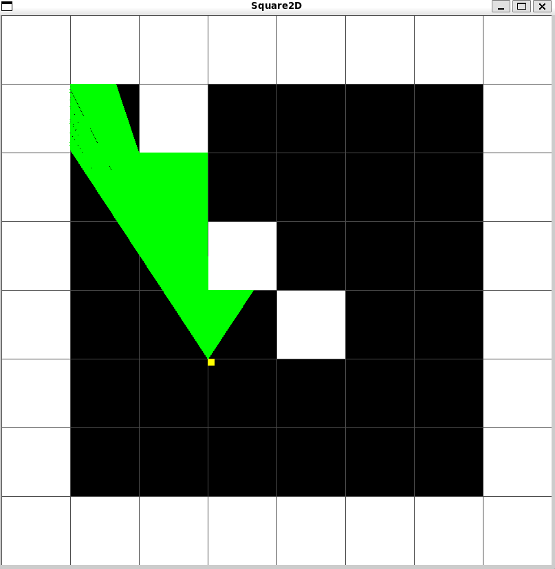

# sq2D - A Raycasting Experiment with miniLibX

## Project Overview

SQ2D is a learning project designed to understand the fundamentals of raycasting technology, which was pioneered in early 3D first-person shooter games like *Wolfenstein 3D*. This project uses the miniLibX graphics library to create a simplified 2D/3D hybrid visualization that demonstrates how early 3D games created the illusion of depth using mathematical techniques.

The project serves as a precursor to developing a full cub3D implementation, helping to understand:

- The mathematics behind raycasting
- How to create a 3D perspective from a 2D map
- Player movement and camera controls
- Basic game loop implementation

## Key Concepts

### Raycasting and Early 3D FPS Games

*Wolfenstein 3D* (1992) was revolutionary because it created the illusion of 3D environments using a technique called raycasting:

- The game world is actually a 2D grid map
- For each vertical slice of the screen, a ray is cast from the player's position
- The ray travels until it hits a wall
- The distance to the wall determines how tall to draw the wall slice
- This creates a perspective projection that looks 3D

This "visual trick" was computationally efficient enough to run on early 1990s hardware.

## File Structure

```
sq2D_test/
├── image1.png
├── Makefile
├── README.md
├── small
├── sq2d
├── include/
│   └── sq2d.h
├── libs/
│   ├── libft/
│   └── minilibx-linux/
├── srcs/
│   ├── atod.c
│   ├── raycaster.c
│   └── sq2d.c
```

- `sq2d.h` - Main header with all definitions and structures
- `sq2d.c` - Core game implementation
- `atod.c` - ASCII to double conversion utility
- `keycodes.h` - Keycode definitions for Linux/X11

## Main Functions

### Core Functions

#### `initmlx(t_sq2d *game)`

- Initializes the miniLibX environment
- Creates window and image buffers
- Sets up key hooks for player input

#### `display(t_sq2d *game)`

- Main rendering function called each frame
- Draws background, player, and rays
- Handles the 2D visualization

#### `keyhook(int key, t_sq2d *game)`

- Processes keyboard input
- Handles player movement (WASD) and rotation (left/right arrows)
- Implements collision detection with walls

### Raycasting Functions

#### `draw_pa_ray(t_sq2d *game)`

This is the core raycasting function that simulates the pseudo-3D effect:

```c
void draw_pa_ray(t_sq2d *game) {
    double ra = game->pa + PI / 6;  // initial angle (player angle + 30 degrees)
    for(int r = 0; r < NUM_RAYS; r++) {
        // Vertical collision detection
        dof = 0;
        disV = 100000;
        float Tan = tan(ra);
        if(cos(ra) > 0.001) { 
            rx = ((int)game->pposx/SPRITE_SIZE)*SPRITE_SIZE + SPRITE_SIZE;
            ry = (game->pposx - rx)*Tan + game->pposy;
            xo = SPRITE_SIZE;
            yo = -xo*Tan;
        }
        // [ ... handle other angles ... ]

        // Horizontal collision detection
        // [ ... similar to vertical detection ... ]

        // Choose the closer intersection
        if(disV < disH) { rx = vx; ry = vy; disH = disV; }

        // Draw the ray
        draw_line(game, game->pposx, game->pposy, rx, ry, rgb(0, 1, 0));

        ra -= (2 * PI / 6) / game->width;  // next ray angle
    }
}
```

##### Raycasting Steps:

- **Angle Initialization:** rays spread from player view, 60-degree FOV
- **Vertical Detection:** find intersections with vertical grid lines
- **Horizontal Detection:** find intersections with horizontal grid lines
- **Distance Comparison:** choose nearest intersection
- **Draw Ray:** visualize in top-down view

#### `FixRad(double pa)`

```c
double FixRad(double pa) {
    if(pa > 2 * PI) pa -= 2 * PI;
    if(pa < 0) pa += 2 * PI;
    return pa;
}
```

Ensures angle stays in [0, 2π] range. Essential for consistent angle calculations during rotation.

#### `distance(float ax, float ay, float bx, float by, float ang)`

```c
float distance(float ax, float ay, float bx, float by, float ang) {
    return cos(ang) * (bx - ax) - sin(ang) * (by - ay);
}
```

Computes the projected distance between two points, considering the view angle.

### Utility Functions

- `mlxpixel()` - Draws a pixel in the image buffer
- `rgb()` - Converts RGB values into packed integer color
- `draw_line()` - Implements Bresenham's line algorithm to draw player direction and rays

## Raycasting Mathematics

### Ray Direction Calculation

```c
double cameraX = 2 * x / (double)game->width - 1;
double rayDirX = game->pdirx + game->planeX * cameraX;
double rayDirY = game->pdiry + game->planeY * cameraX;
```

### DDA Algorithm

```c
double deltaDistX = fabs(1 / rayDirX);
double deltaDistY = fabs(1 / rayDirY);

if(rayDirX < 0) {
    stepX = -1;
    sideDistX = (game->pposx - mapX) * deltaDistX;
} else {
    stepX = 1;
    sideDistX = (mapX + 1.0 - game->pposx) * deltaDistX;
}

while(hit == 0) {
    if(sideDistX < sideDistY) {
        sideDistX += deltaDistX;
        mapX += stepX;
        side = 0;
    } else {
        sideDistY += deltaDistY;
        mapY += stepY;
        side = 1;
    }
    if(worldMap[mapX][mapY] > 0) hit = 1;
}
```

### Fisheye Correction

```c
if(side == 0) perpWallDist = (mapX - game->pposx + (1-stepX)/2) / rayDirX;
else          perpWallDist = (mapY - game->pposy + (1-stepY)/2) / rayDirY;

int lineHeight = (int)(height / perpWallDist);
```

### 3D Projection

```c
int drawStart = -lineHeight / 2 + height / 2;
if(drawStart < 0) drawStart = 0;
int drawEnd = lineHeight / 2 + height / 2;
if(drawEnd >= height) drawEnd = height - 1;

for(int y = drawStart; y < drawEnd; y++) {
    buffer[y][x] = texture[texX][texY];
}
```

### Key Techniques

- **Direction Vectors:** `pdirX/Y` control player direction
- **Plane Vectors:** `planeX/Y` control FOV width
- **Texture Mapping:** maps hit coordinates to texture pixels
- **Collision Optimization:** efficient grid stepping via DDA
- **Rotation Matrix:**

```c
oldDirX = dirX;
dirX = dirX * cos(rotSpeed) - dirY * sin(rotSpeed);
dirY = oldDirX * sin(rotSpeed) + dirY * cos(rotSpeed);

oldPlaneX = planeX;
planeX = planeX * cos(rotSpeed) - planeY * sin(rotSpeed);
planeY = oldPlaneX * sin(rotSpeed) + planeY * cos(rotSpeed);
```

## How to Build and Run

- Clone the repository
- Run `make` to build the project
- Execute with a map file: `./sq2d maps/map1.txt`

## Controls

- `WASD`: Move player forward/backward and strafe
- `Left/Right Arrows`: Rotate view
- `ESC`: Quit game


## Learning Outcomes

This project demonstrates:

- How early 3D games used 2D maps with raycasting
- The mathematics behind perspective projection
- Basic game loop implementation
- Player movement and collision detection
- Visual tricks to create 3D illusions

## Future Improvements

- Add full 3D perspective rendering
- Implement texture mapping
- Add sprite rendering
- Improve collision detection
- Add basic game mechanics

This project showcases the mathematical techniques used to create convincing 3D effects on early hardware and forms a great foundation for modern 3D graphics programming.
